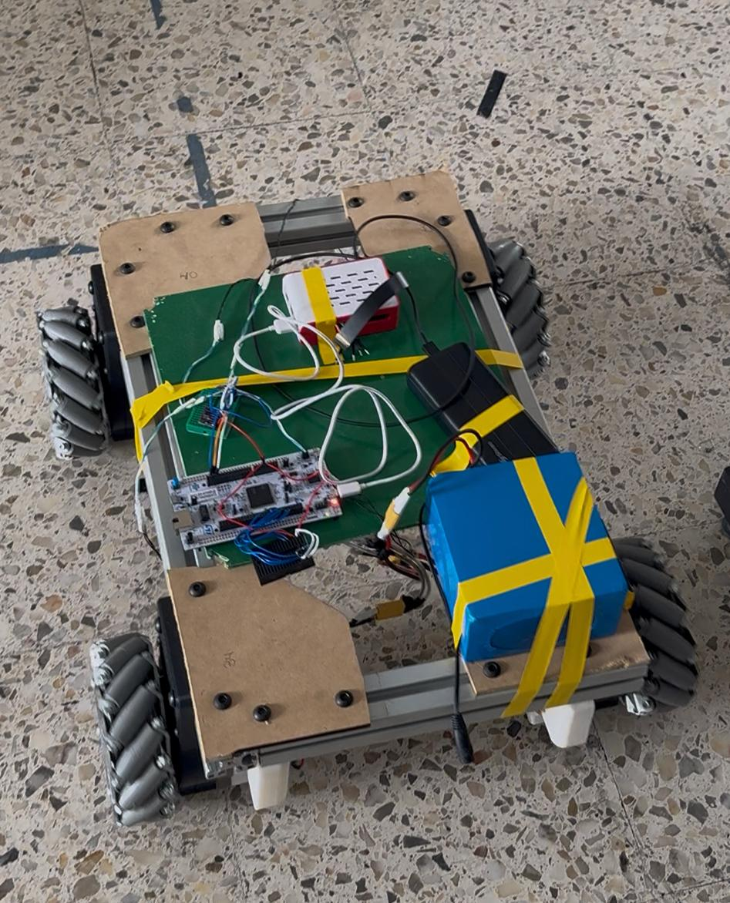

# Weekly Spotlights
This page is a collection of weekly spotlights that highlight the progress of the omnibase team. Each spotlight is a summary of the work done by the team in a week.

Member status:

- 🔍: Research
- 💻: Development
- 📝: Documentation
- 🔄: Refactoring
- 🔧: Bug fixing
- 🤝: Participation in other subteam

## 2026-04-07

| Name     | Stauts |
| -------- | ------ |
| Fregoso |    🤝  |
| Ximena |   💻  |
| Roger   |    💻   |
| Jordan  |   💻|
| Samuel |   🤝  
| Daniel hinojosa |   💻  |
| Justino |  💻  |
| Ale G. |  💻  |
| Ian |  💻  |

**Done:**
- Provisional assembly of the omni base.

- Moving the omni base using ROS Twist.

<iframe width="560" height="315" src="https://www.youtube.com/embed/0czr85DVt5A" title="Omnibase Twist Control" frameborder="0" allowfullscreen></iframe>

- Moving the base using a mecanum base simulation with Nav.

<iframe width="560" height="315" src="https://www.youtube.com/embed/GDL1n9IslLY" title="Mecanum Base Simulation with Nav" frameborder="0" allowfullscreen></iframe>

**Development**:
- Final assembly of the omni base.
- Start implementing odometry using the IMU (yet to arrive).
- Tune PI control within each ODrive for each motor.
- Check current consumption under load.
- Development of the base PCBs.
- Both C1 LiDARs have been ordered.

## 2026-03-24

| Name     | Stauts |
| -------- | ------ |
| Fregoso |    🤝  |
| Ximena |   💻  |
| Roger   |    💻   |
| Jordan  |   💻|
| Samuel |   🤝  
| Daniel hinojosa |   💻  |
| Justino |  💻  |
| Ale G. |  💻  |
| Ian |  💻  |

**Development**:
- Completed the first general documentation of the omnibase.
- Made corrections to the base CAD model.
- Currently printing the fixed gearboxes for the base motors.
- Started an initial simulation of the base in Webots instead of Gazebo.

## 2026-03-10

| Name     | Stauts |
| -------- | ------ |
| Fregoso |    🤝  |
| Ximena |   💻  |
| Roger   |    💻   |
| Jordan  |   💻|
| Samuel |   🤝  
| Daniel hinojosa |   💻  |

**Development**:
- First progress on the PCBs for motor control and odometry implementation on the omnibase.

- Implementation of configuration and control functions via CAN for the ODrives on the STM32.
- Started the motor mount design, adapting the previous motor anchoring to the 4040 extrusion profile.
